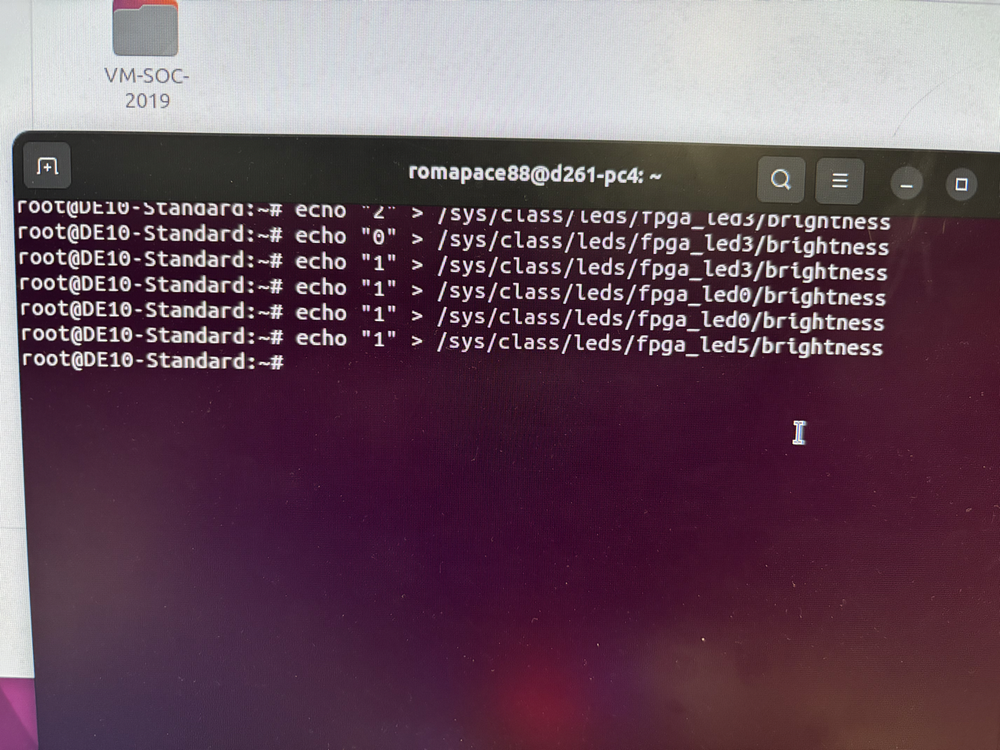
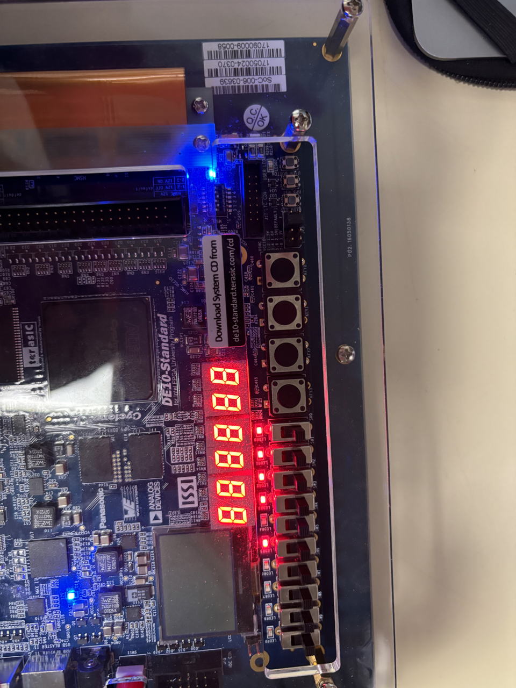
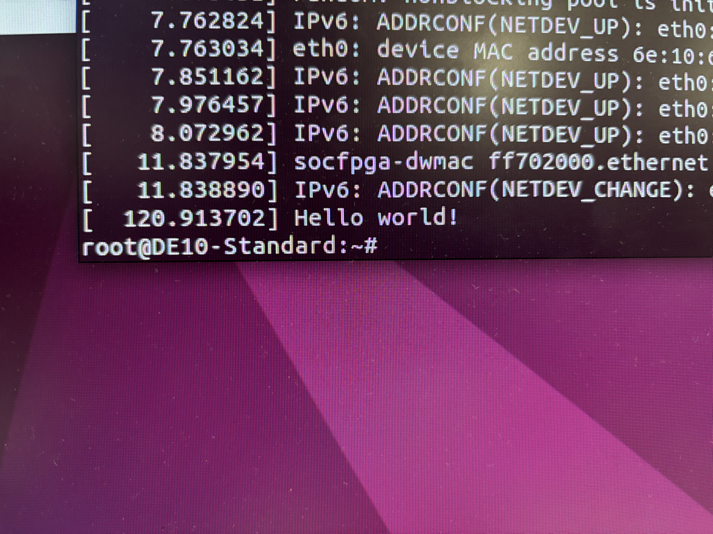
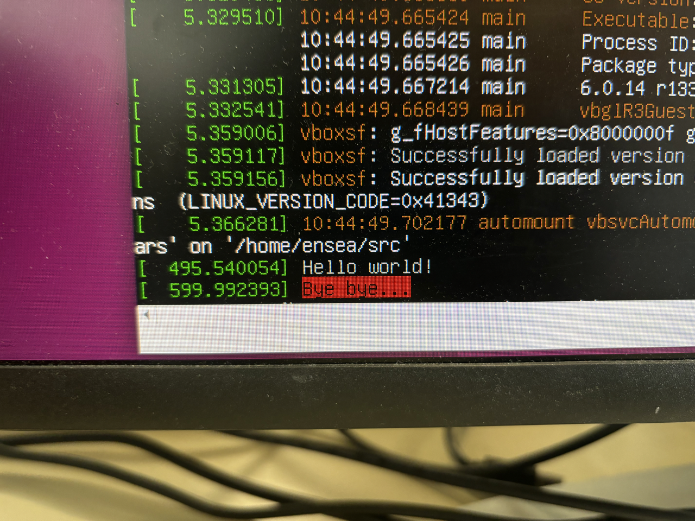
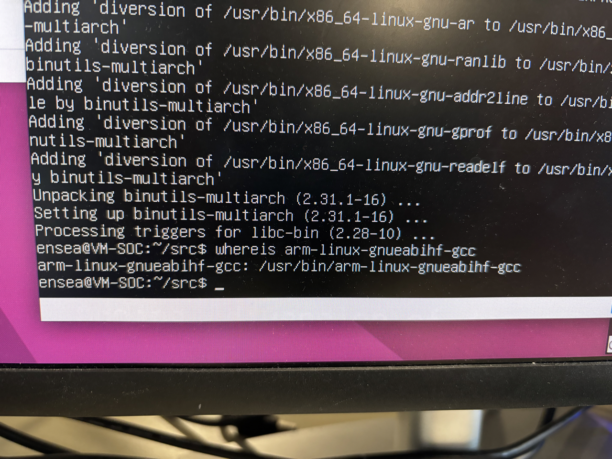
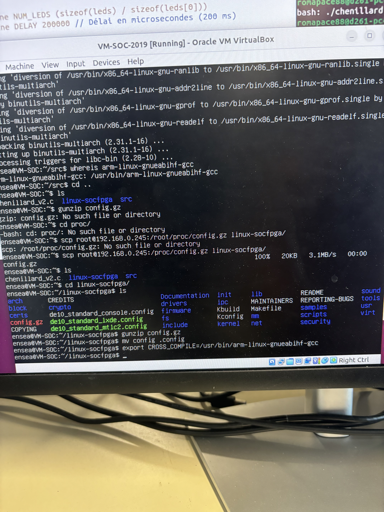
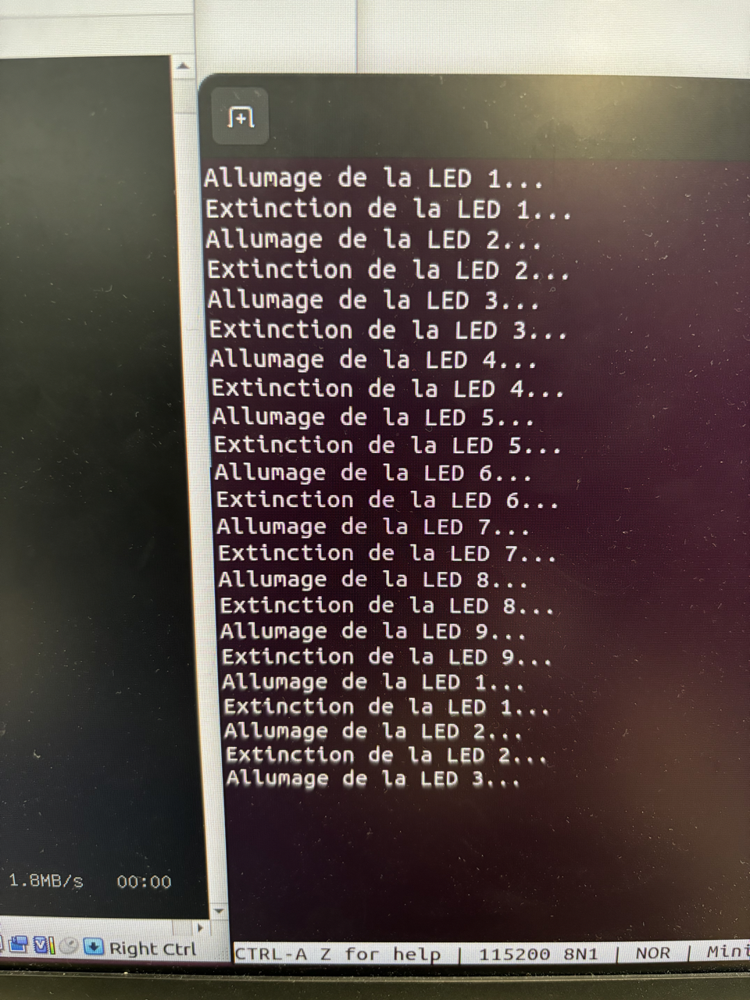
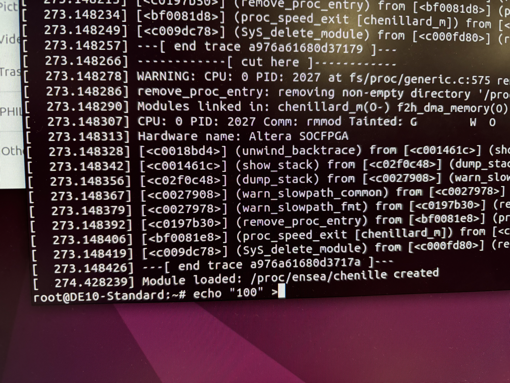
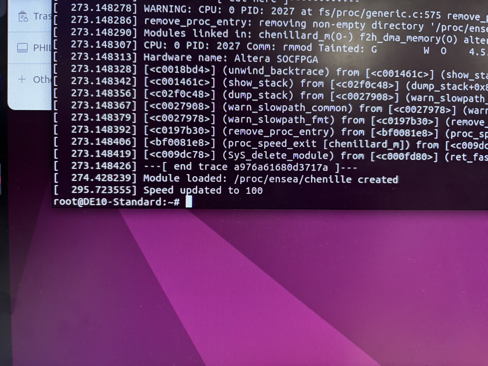
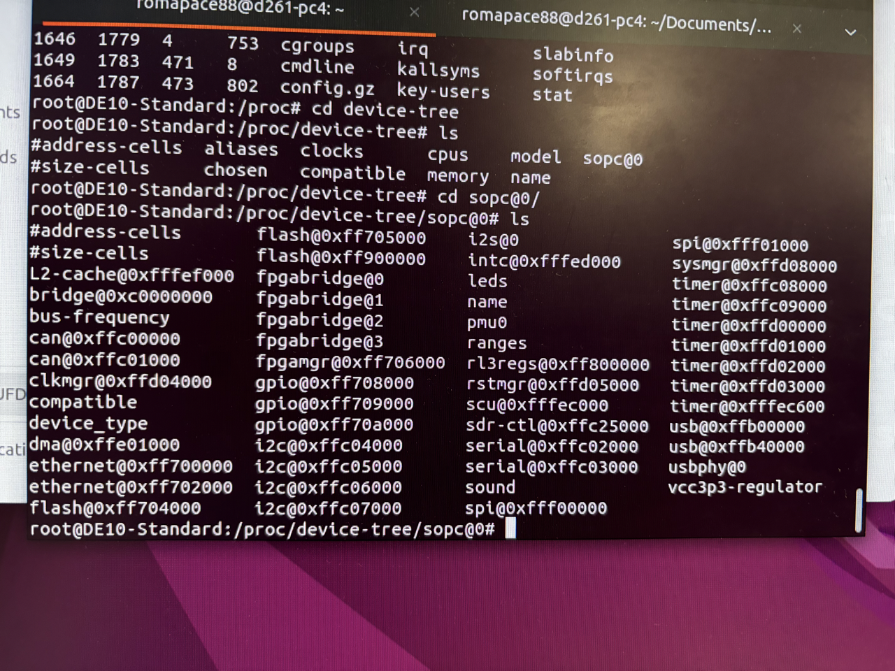

# TP Linux embarqué 

Vous vous trouvez dans le ReadMe du TP linux embarqué par Marie CARONELLO et Romain PACE élèves à l'ENSEA. Ce TP a pour objectif d'installer et de configurer un système embarqué basé sur la carte VEEK-MT2S, en utilisant Linux pour interagir avec le matériel. Nous avons utilisé une machine virtuelle VirtualBox pour effectuer la compilation croisée des programmes destinés à être exécutés sur le SoC de la carte VEEK-MT2S.

## 1 Prise en main


### 1.1 Préparation de la carte SD
La première étape consiste à flasher la carte SD avec l'image fournie par Tera-sic. L'image à utiliser est le fichier VEEK_MT2S_LXDE.img.
Sous Linux, il a fallu d'abord identifier le périphérique correspondant à la carte SD. Pour cela, j'ai utilisé la commande ls /dev avant et après l'insertion de la carte. Cela m'a permis de repérer le périphérique de la carte SD. Ensuite, j'ai utilisé la commande dd pour flasher l'image sur la carte SD :

````ruby
sudo dd if=VEEK_MT2S_LXDE.img of=/dev/sdX bs=4k status=progress sync
````

### 1.2 Démmarage
Après avoir inséré la carte SD dans la carte VEEK-MT2S et allumé la carte, le système Linux a démarré automatiquement. L'interface s'est lancée et m'a permis d'explorer les programmes fournis sur le bureau.Cependant, sans clavier, l'interaction avec le système était limitée, donc nous devons configurer une connexion série pour pouvoir interagir plus facilement.


### 1.3 Connexion au système
#### 1.3.1 Liaison série

J'ai utilisé le port mini USB pour établir une connexion série avec la carte. j'ai utilisé minicom pour me connecter à la carte via le port série :

````ruby
 minicom -D /dev/ttyUSB0 -b 115200
````


#### 1.3.2 Configuration réseau


Après avoir connecté la carte VEEK au réseau via un câble Ethernet, j'ai utilisé la commande suivante pour vérifier l'adresse IP de la carte :
````ruby
ifconfig
````

Ensuite, j'ai modifié le fichier de configuration réseau /etc/network/interfaces pour activer le DHCP sur l'interface eth0 :


````ruby
sudo vim /etc/network/interfaces
````
J'ai ajouté les lignes suivantes dans le fichier :
````ruby
auto eth0 
iface eth0 inet dhcp
allow-hotplug eth0 
````

Après avoir sauvegardé le fichier et redémarré la carte, l'adresse IP a été correctement attribuée et la connexion réseau était fonctionnelle. J'ai vérifié l'adresse IP avec la commande ifconfig et j'ai utilisé ping pour tester la connectivité réseau.

#### 1.3.3 Connexion SSH
Pour me connecter à la carte via SSH, j'ai vérifié que la ligne suivante était présente dans le fichier /etc/ssh/sshd_config :
````ruby
PermitEmptyPasswords yes
````
J'ai ensuite pu me connecter à la carte VEEK via SSH depuis le PC en utilisant la commande suivante :

````ruby
ssh root@192.160.0.245
````

Où 192.160.0.245 est l’adresse ip de la carte.

### 1.4 Découverte de la cible

#### 1.4.1 Exploration du système de fichiers
J'ai exploré le système de fichiers en accédant aux répertoires /proc et /sys/class. J'ai consulté les fichiers suivants pour obtenir des informations sur le système 
Pour obtenir des informations sur le processeur j’ai utilisé: « cat /proc/cpuinfo »
Pour examiner les informations sur les ports d'entrée/sortie et la mémoire du système j’ai utilisé les lignes de code suivantes : « /proc/ioports » « /proc/iomem »
Pour interagir avec les LEDs de la carte cette fois on utilise : « /sys/class/leds/fpga_led1/brightness »

#### 1.4.2 Compilation croisée

Afin de compiler un programme pour le SoC, j'ai utilisé un environnement de compilation croisée. J'ai installé le compilateur ARM sur ma machine avec la commande suivante :

````ruby
sudo apt install gcc-arm-linux-gnueabi
````

Ensuite, j'ai utilisé une machine virtuelle (VM-SOC-2019) pour effectuer la compilation. J'ai créé un programme "Hello World!" en C et l'ai compilé avec le compilateur croisé : « arm-linux-gnueabihf-gcc hello.c -o hello.o »

Une fois le programme compilé, j'ai transféré l'exécutable sur la carte SoC via SSH avec la commande scp : « scp hello.o root@192.160.0.245:/home/root »
J'ai ensuite exécuté le programme sur la carte pour vérifier son bon fonctionnement :
````ruby
./hello.o
````

Nous avons vu apparaitre le message « Hello word »


#### 1.4.3 Accès au matériel

Pour interagir avec le matériel de la carte, comme les LEDs, j'ai utilisé les fichiers de contrôle des LEDs. Par exemple, pour allumer une LED rouge, j'ai exécuté la commande suivante :

````ruby
echo "1" > /sys/class/leds/fpga_led1/brightness
````

Dans la ligne de code précédente on a echo « 1 » qui allume une led et echo « 0 » pour éteindre la led. Pour modifié quelle led est allumée ou éteinte on modifie « fpga_led1 » J’ai testé différentes LEDs en modifiant le numéro de la LED et cela me permet d’allumer plusieurs led en meme temps


<p align="center">
  
</p>

<p align="center">
  
</p>

#### 1.4.4 Chenillard
Enfin, j'ai écrit un programme en C pour créer un chenillard qui allume et éteint les LEDs en séquence. Le programme ouvre et écrit dans les fichiers /sys/class/leds/fpga_ledX/brightness pour manipuler les LEDs à intervalles réguliers. Le programme réalise un chenillard en allumant et éteignant la LED à intervalles réguliers. Après la compilation et l'exécution du programme, les LEDs ont bien clignoté comme prévu.


## 2 Modules kernel

Cette partie a pour objectif de développer et tester des modules noyaux pour une plateforme embarquée. Nous allons donc devoir accéder directement aux registres depuis l’espace utilisateur puis compiler et tester des modules noyaux sur une VM et sur la carte cible et cross-compiler les modules pour la carte SoC.

### 2.1 Accès aux Registres

Tout d'abord nous devons créer n programme accédant directement aux registres depuis l’espace utilisateur en remappant la mémoire avec la fonction mmap(). Pour cette méthode nous devons accéder à /dev/mem , remapper la mémoir et ensuite utiliser virtual base pour accéder et modifier les registres GPIO. Cette méthode contourne le noyau Linux et peut provoquer des conflits d’accès si d’autres processus tentent de manipuler les mêmes registres. Elle n’est pas sécurisée pour une utilisation en production

### 2.2 Compilation de module noyau sur la VM

Nous devons donc développer nos propres modules noyaux, pour pouvoir compiler les modules noyaux dans la VM nous allons installer 

````ruby
sudo apt install linux-headers-amd64
sudo apt install bc
````

On utilise le fichier hello.c pour compiler notre premier module à l'aide de la commande -make. on utilise ensuite les lignes suivantes pour chargez et testez le module avec les commandes suivantes.

````ruby
sudo insmod hello.ko
sudo dmesg
sudo rmmod hello
````

En utilisant la ligne dsmed on peut voir la compilation du code hello.c :

<p align="center">
  
</p>
<p align="center">
  
</p>

### 2.3 CrossCompilation de modules noyau

#### 2.3.0 Récupération du Noyau Terasic

Les sources du noyau utilisé par la carte VEEK sont déjà récupérées pour compiler les modules dans la VM, mais voici les commandes nécessaires :

````ruby
git clone https://github.com/terasic/linux-socfpga/
git checkout 6b20a2929d54
git config core.abbrev 7
````

Le commit 6b20a29 correspond à la version du noyau utilisée sur la carte, identifiable via uname -a.

#### 2.3.1 Préparation de la compilation

On installe les outils nécessaires pour la cross-compilation avec les ligens de code suivantes:

"sudo apt install bc
sudo apt install crossbuild-essential-armhf
sudo apt install binutils-multiarch"

On note le chemin vers ces compilateurs qui est usr/bin/arm-linux-gnueabihf-gcc

<p align="center">
  
</p>

#### 2.3.2 Récupéreation de la configuration actuelle du noyau

On se connecte à la carte SoC et copiez le fichier /proc/config.gz avec la ligne de commande suivante :

````ruby
scp root@192.160.0.245:/proc/config.gz
````

Puis on décompresse et renomme le fichier avec les lignes de commandes ci-dessous : 

````ruby
gunzip config.gz
mv config .config
````

tel que nous pouvons le voir sur l'image

<p align="center">
  
</p>

Placez le fichier .config dans le dossier contenant les sources du noyau, puis exécutez les commandes suivantes :

 ````ruby
export CROSS_COMPILE=usr/bin/arm-linux-gnueabihf-
export ARCH=arm
make prepare
make scripts
````

Les lignes export configurent les variables d’environnement nécessaires pour la compilation.
Le chemin du compilateur se termine par un tiret - car il sert de préfixe pour divers outils tel que gcc.

#### 2.3.3 Hello World

Pour refaire les exercices précédents on doit tout d'baord adapter le Makefile, pour cela on va modifier le chemin vers le noyau tel que 

````ruby
CFLAGS_MODULE=-fno-pic
````

Pour la compilation du module on a du créerun nouveau dossier TP2 et ensuite compiler le module avec -make.

Pour tester le module on va donc copier le module compilé sur la carte SoC avec la commande :

````ruby
scp hello.ko root@192.160.0.245:/home/root/
````

Puis de la mêùe manière qu'à la partie 2.2 on teste le module avec dsmeg et on voit bien apparaitre "Helllo World..." et "...Bye Bye"

#### 2.3.4 Chenillard 

Dans cette dernière sous partie on va donc faire un chenillard on utlisant les modules de noyaux. Pour cela on va écrire un code en langaeg C. Et on va ensuite tester ce module commme précédement avec la commande dsmeg. On va simuler l'allumage des led de facon succéssive tel que l'image ci-dessous nous le montre

<p align="center">
  
</p>

Ensuite on complète notre code pour que l'on puisse modifier la vitesse, on modifie la vitesse avec la commande echo "100" et on voit que cette vitesse a été modifiée avec la simulation par speed updated to 100

<p align="center">
  
</p>
<p align="center">
  
</p>

## 3 Device tree

Cette partie du TP a pour objectif de définir un périphérique led personnalisé à l'aide du device tree et de développer un module noyau capable d’interagir avec ce périphérique. Dans un premier temps nous allons modifier le fichier device tree source et compiler un fichier device tree blob compatible, et créer un module noyau pour piloter un chenillard avec des fonctionnalités avancées.

On commence par suivre les instructions du TP 

On localise le fichier soc_system.dts dans notre répertoire de travail:

````ruby
VEEK-MT2S_v.1.0.3_SystemCD/Demonstration/SoC_FPGA/ControlPanel/Quartus/soc_system.dts
````

On installe ensuite le compilateur device tree  avec :

````ruby
sudo apt install device-tree-compiler
````

Et on compilee le fichier DTS en DTB :

````ruby
dtc -O dtb -o soc_system.dtb soc_system.dts
````

On envoie enfin le le fichier DTB sur la VEEK :

````ruby
mkdir /root/mntboot
mount /dev/mmcblk0p1 /root/mntboot
````

Finalement on renomme l’ancien fichier DTB :

````ruby
mv /root/mntboot/soc_system.dtb /root/mntboot/soc_system.dtb.old
````

On finit par copier le nouveau fichier DTB depuis le PC :

````ruby
scp soc_system.dtb root@<IP_VEEK>:/root/mntboot/
````

On reboot la carte et pour vvérifier les modifications on effectue la ligne de commande suivante :

````ruby
x/proc/device-tree/sopc@0/.
````

<p align="center">
  
</p>

### 3.1 module accedant au LED via /dev

Une fois qu'on a réccupéré le fichier gpio-led.c pour le simuler on le fait passer en top module avec la fonction -lsmod

<p align="center">
  
</p>
<p align="center">
  
</p>

